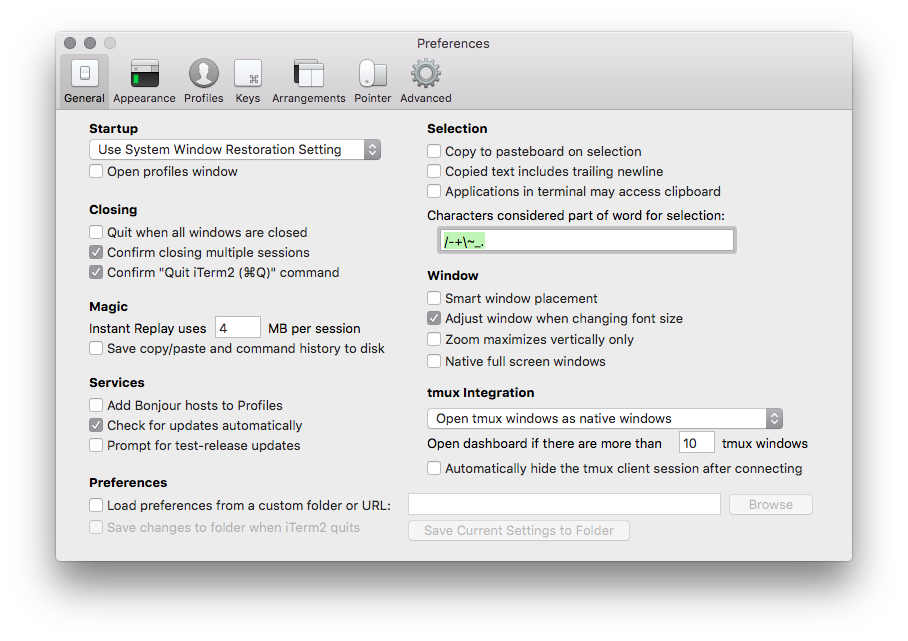
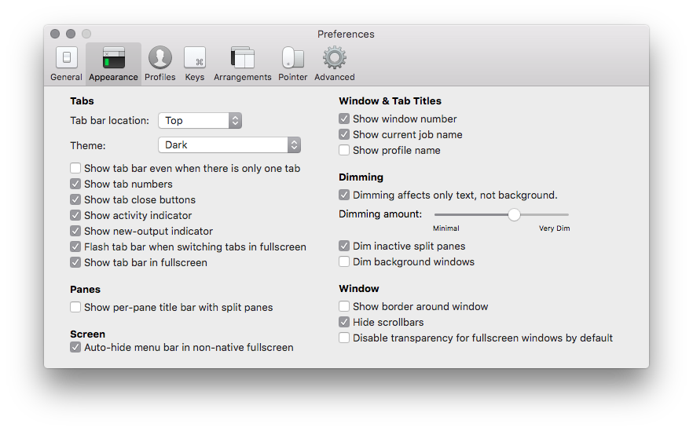

# iTerm2 Preferences

## Profiles

To install the profile, create a symlink:

    ln ~/.vim/other/iTerm2/iTerm2.plist ~/Library/Application\ Support/iTerm2/DynamicProfiles/

Don't forget to "Set as Default" afterwards.

## General

## Appearance

